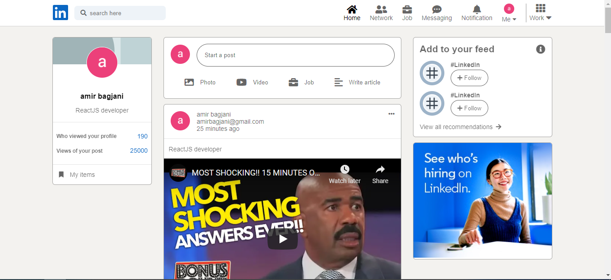

# LinkedIn clone

LinkedIn clone





## Table of contents
* [General info](#general-info)
* [Technologies](#technologies)
* [Setup](#setup)

## General info
This project is similar to linkedIn which developed with ReactJS.
	
## Technologies
Project is created with:
* ReactJS version: 17.0.2
* typescript version: 4.6.2
* node-sass version: 7.0.1
* firebase version: 8.5
* reduxjs/toolkit version: 1.8.0


## Setup
To run this project, clone the project

```bash
  git clone https://github.com/Amir-Bagjani/LinkedIn-typescript-sass-firebase.git
```

Go to the project directory

```bash
  cd LinkedIn-typescript-sass-firebase
```

Install dependencies

```bash
  npm install
```

Start the server

```bash
  npm run start
```


## Author

- [@Amir-Bagjani](https://github.com/Amir-Bagjani)


